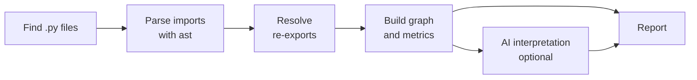

<p align="center">
  
</p>

<p align="center">
  <strong>See how your Python modules really depend on each other, and where they knot up.</strong>
</p>

<p align="center">
  
  
  
  
</p>

---

Every Python project starts as a few clean modules. A year later, `services` imports
`models`, `models` imports `utils`, `utils` quietly imports `services`, and changing one
file breaks three others you never touched.

**unskein** pulls that skein apart. Point it at a project and it maps every import between
your modules, measures how tightly each one is bound to the rest, finds the cycles, and
tells you, in plain language, which knots are worth cutting first.

```bash
unskein scan .
```

> [!NOTE]
> unskein is in **alpha** (v0.3.0). `unskein scan <path>` already works end to end (graph,
> coupling, cycles, findings, AI interpretation, Markdown report in English or Spanish), and
> `unskein untangle <path>` plans how to undo the tangles. The first sample below shows the
> v0.1 report, AI section included.

## What you get

```text
$ unskein scan ./shop

# Analysis of shop

## Summary
42 modules, 118 internal dependencies. 2 dependency cycles.
Architecture health: fair.

## Dependency cycles
1. shop.orders → shop.billing → shop.orders
2. shop.catalog → shop.search → shop.index → shop.catalog

## Most coupled modules (top 3 of 42)
| Module          | Ca | Ce | Instability |
|-----------------|----|----|-------------|
| shop.core.db    | 19 |  2 | 0.10        |
| shop.orders     |  8 |  9 | 0.53        |
| shop.api.routes |  0 | 14 | 1.00        |

## Problems flagged (AI)
[high] orders and billing depend on each other
  Any change to invoice logic forces a change in order handling, and vice versa.
  Recommendation: move the shared Invoice type into its own module both can import.
```

- **Dependency graph**: every import between your own modules, with third-party
  packages kept out of the way.
- **Coupling metrics**: afferent (Ca), efferent (Ce) and instability for each module,
  so you can tell a stable core from a fragile hub.
- **Architecture findings**: unstable dependencies, bottlenecks, growing orchestrators
  and orphan modules, each with a recommendation. Computed from the graph, so they
  appear also without AI.
  An optional layer check (`[layers]` in `.unskein.toml`) reports imports that go up the
  layers you declare.
- **Package overview and impact**: coupling measured between packages, and for each
  coupled module how many others depend on it, directly or indirectly.
- **Monorepo distributions**: with no configuration, each `pyproject.toml` or `setup.cfg`
  is a distribution, and unskein says whether each one can be installed alone. Imports
  inside a `try` that catches import errors (without re-raising) count as optional, so they
  are not reported.
  It also reports dependencies declared only in an extra but imported at load time,
  imports of code no distribution ships, and cycles between distributions, with the
  status of each edge. Each finding has a fix you can copy, such as
  `add "litellm>=1.105.0" to [project] dependencies in enterprise/pyproject.toml`.
  Against deptry and tach on litellm, this replaces hundreds of per-import lines with one
  finding per pair of distributions and drops their false positives on guarded imports.
- **Imports that break in production**: an import of a project module that does not
  exist, from packaged code, at load time or in a function and unguarded. Imports under
  `TYPE_CHECKING`, guarded ones and test imports are kept apart. pylint and mypy also find
  the broken import, but they need the environment installed and do not tell these uses
  apart. unskein needs no environment, and its fix comes from the code: it names the
  module that defines the symbol, or says that none does. On litellm it found two such
  imports, one of them to a module deleted in a refactor.
- **Native boundary**: compiled extensions (`.so`, `.pyd`, Cython `.pyx`, maturin
  `module-name`) and stub-only modules (`.pyi`) are nodes with their exact Ca and an
  unknown Ce, since what compiled code imports cannot be read. A section lists, for each
  one, what proves it exists, how packaged code uses it and whether it works without it,
  and a finding flags an extension the code guards in one place (expecting it can be
  missing) but imports unguarded elsewhere. On litellm, grimp and pydeps do not see its
  Rust extension at all; tach sees it only once it is named in its configuration, and
  neither tach nor mypy tells the guarded import apart from the five that would raise
  `ImportError` without the extension.
- **Star imports**: one finding per module imported with `from x import *` outside a
  package facade, with the explicit import to write for each statement. The names are
  computed with the whole project, and when in doubt a name is kept. On litellm, applying
  all 74 fixes leaves every one of its 2663 modules importing exactly as before; removestar's
  rewrite of the same files makes `import litellm` fail (a name another module imports
  through a star was dropped), along with 1515 other modules.
- **Untangle plan** (`unskein untangle`): for each tangle, the imports to cut, the
  cheapest refactoring step for each (with file, line and symbols) and a before/after
  simulation. None of the open-source Python dependency tools we surveyed (pydeps,
  import-linter, tach) proposes cuts; the commercial ones that do (Sonargraph,
  Structure101, Lattix) target Java/.NET.
- **Cycle detection**: import loops that make code hard to test and impossible to split.
  Only imports that run when the code is imported count; those inside functions or under
  `TYPE_CHECKING` are reported apart as hidden coupling.
- **Re-exports resolved**: `from app import Engine` is traced through `__init__.py`
  facades to the module that actually defines `Engine`, so cycles hidden behind a
  package's `__init__.py` still show up. `import pkg as p` followed by `p.name` is
  traced the same way.
- **An AI reading of the numbers** (optional): a short summary and the problems worth
  fixing, in English or Spanish.

## Untangling a real project

`unskein untangle` on [rich](https://github.com/Textualize/rich) (35 modules in one
tangle), with no AI involved:

```text
$ unskein untangle ./rich

Tangles: 1 · imports to cut: 31 · total cost: 104.
Simulation after the cuts: tangles 1 → 0, cycles 100+ → 0.

 Import                    Step                   Cost  Evidence
 rich.console → rich.emoji Move under TYPE_CHECKING  1  rich/console.py:44 · EmojiVariant
 rich.palette → rich.color Lazy import               3  rich/palette.py:78 · Color
 rich.box → rich.panel     Move the symbol           4  rich/box.py:426 · Panel
```

The cuts are a heuristic (not guaranteed minimal) and the simulation is optimistic: read
the output as a plan to review. On networkx the plan has 32 cuts, mostly "import from the
module that defines it" instead of through the package's `__init__.py`.

## How it works



The graph and the metrics are **deterministic**: they are always computed from your
code, without an LLM. The AI only interprets numbers the graph has already produced.
It never decides what counts as a module or an import. If the AI step is not configured
or fails, you still get the full report.

unskein never runs your code. It reads it with Python's own `ast` parser.

## Quickstart

```bash
pip install unskein
unskein scan path/to/project
```

No config file is needed. To tune settings, `unskein init` writes a `.unskein.toml` in
the current folder with every option commented out at its default (`--user` writes
`~/.config/unskein/config.toml` instead). A project's `.unskein.toml` is read from the
folder you analyze; the user file applies to every project. Once a `.unskein.toml` works
for you, `unskein config save` validates it and saves it as your user file.

`unskein guide` shows the full usage guide of the installed version, in English or
Spanish (`--lang es`).

Common options:

```bash
unskein scan . --no-ai                         # metrics only, no LLM call
unskein scan . --exclude "migrations/"        # skip paths (repeatable)
unskein scan . --min-severity medium           # hide low-severity findings
unskein scan . -o report.md                    # also save the report as Markdown
unskein scan . --lang es                       # informe en español
```

Paths in `.gitignore` are skipped automatically. To exclude code that *is* tracked in
git, such as generated files, list it in a `.unskeinignore` file with the same syntax.

Test code (`tests/`, `test_*.py`, `*_test.py`, `conftest.py`) is left out by default,
since tests import almost everything and would drown out the real architecture. Pass
`--include-tests` to analyze it too. Projects using a `src/` layout are detected
automatically; for other layouts, set `source_roots` in `.unskein.toml`.

### Exit codes

| Code | Meaning |
|---|---|
| `0` | Analysis finished with no high-severity problems (`--min-severity` only filters what is shown) |
| `1` | Usage error: bad path, no `.py` files, invalid config |
| `2` | Analysis finished and found high-severity problems |
| `3` | Internal error (a bug; the traceback is shown) |

## Bring your own model

The AI step goes through [LiteLLM](https://docs.litellm.ai/), so any provider it
supports works, including a free local model with [Ollama](https://ollama.com/):

```bash
export UNSKEIN_AI_MODEL="ollama/qwen2.5-coder:7b"
export UNSKEIN_AI_API_BASE="http://localhost:11434"
unskein scan .
```

For a cloud model, name it `provider/model` and give its key. The provider's own
variable works, or `UNSKEIN_API_KEY`:

```bash
export UNSKEIN_AI_MODEL="anthropic/<model>"
export ANTHROPIC_API_KEY="sk-ant-..."
```

Behind a team [LiteLLM Proxy](https://docs.litellm.ai/docs/simple_proxy)? Use the
`litellm_proxy/` prefix and your virtual key. unskein asks the proxy whether the alias
is a reasoning model, so any alias name works:

```bash
export UNSKEIN_AI_MODEL="litellm_proxy/my-alias"
export UNSKEIN_AI_API_BASE="https://litellm.example.com"
export UNSKEIN_API_KEY="sk-..."
```

`unskein guide` has a recipe for each provider: OpenAI, Claude, Gemini, Azure OpenAI,
AWS Bedrock, Mistral, Groq, DeepSeek, LiteLLM Proxy and OpenAI-compatible local
servers. Direct calls are limited to 60 s; through a proxy the proxy decides. If the
AI call fails for any reason, the report is still produced, with a notice.

Settings are read in this order, first match wins:

1. Environment variables: `UNSKEIN_AI_MODEL`, `UNSKEIN_API_KEY`, `UNSKEIN_AI_API_BASE`
2. `.unskein.toml` in the analyzed folder, or `~/.config/unskein/config.toml` for every
   project (`unskein init --user` creates it, `unskein config save` fills it from a
   `.unskein.toml`)
3. The `--api-key` flag, for quick tests only, since it ends up in your shell history

Templates: [`.env.example`](.env.example) (unskein reads environment variables, not
`.env` files: load it in your shell first) and `unskein init` for a commented
`.unskein.toml`.

## Privacy

**No telemetry. None.** unskein does not collect usage data, not even anonymously.
The only network request it makes is the LLM call you configure yourself, and there
is none with `--no-ai` or a local Ollama model. With a cloud model, what leaves your
machine is module names and coupling metrics (counts, cycles, tangles), never source
code or file paths. unskein also stops LiteLLM from downloading its price map or
sending telemetry. The timing and memory stats shown with `--verbose` are computed
on your machine and stay there. API keys never appear in logs or reports.

## Roadmap

| Status | Scope |
|---|---|
| **Available** | Python: module-level graph, coupling metrics, import-time cycles and hidden coupling, architecture findings and layer checks, package overview and impact, untangle plan, Markdown report in English or Spanish, optional AI interpretation |
| **Coming soon** | Support for other languages |
| Also planned | Code suggestions in AI recommendations, JSON output |
| Later | CVE analysis and a full architecture map |

## Contributing

Issues and pull requests are welcome, in English or Spanish. Start with
[CONTRIBUTING.md](CONTRIBUTING.md) and [docs/architecture.md](docs/architecture.md).

```bash
uv sync
uv run pytest --cov
```

## License

[MIT](LICENSE). The name comes from *unskein*: to unwind a skein of yarn.
