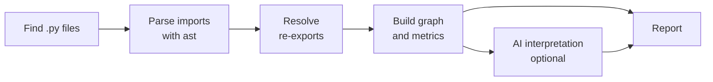

<p align="center">
  
</p>

<p align="center">
  <strong>See how your Python modules really depend on each other, and where they knot up.</strong>
</p>

<p align="center">
  
  
  
  
</p>

---

Every Python project starts as a few clean modules. A year later, `services` imports
`models`, `models` imports `utils`, `utils` quietly imports `services`, and changing one
file breaks three others you never touched.

**unskein** pulls that skein apart. Point it at a project and it maps every import between
your modules, measures how tightly each one is bound to the rest, finds the cycles, and
tells you, in plain language, which knots are worth cutting first.

```bash
unskein scan .
```

> [!NOTE]
> unskein is in **alpha** (v0.1.1). `unskein scan <path>` already works end to end (graph,
> coupling, cycles, AI interpretation, Markdown report in English or Spanish). The
> sample below shows the v0.1 report, AI section included.

## What you get

```text
$ unskein scan ./shop

# Analysis of shop

## Summary
42 modules, 118 internal dependencies. 2 dependency cycles.
Architecture health: fair.

## Dependency cycles
1. shop.orders → shop.billing → shop.orders
2. shop.catalog → shop.search → shop.index → shop.catalog

## Most coupled modules (top 3 of 42)
| Module          | Ca | Ce | Instability |
|-----------------|----|----|-------------|
| shop.core.db    | 19 |  2 | 0.10        |
| shop.orders     |  8 |  9 | 0.53        |
| shop.api.routes |  0 | 14 | 1.00        |

## Problems flagged (AI)
[high] orders and billing depend on each other
  Any change to invoice logic forces a change in order handling, and vice versa.
  Recommendation: move the shared Invoice type into its own module both can import.
```

- **Dependency graph**: every import between your own modules, with third-party
  packages kept out of the way.
- **Coupling metrics**: afferent (Ca), efferent (Ce) and instability for each module,
  so you can tell a stable core from a fragile hub.
- **Architecture findings**: unstable dependencies, bottlenecks, growing orchestrators
  and orphan modules, each with a recommendation. Computed from the graph, so they
  appear also without AI.
  An optional layer check (`[layers]` in `.unskein.toml`) reports imports that go up the
  layers you declare.
- **Package overview and impact**: coupling measured between packages, and for each
  coupled module how many others depend on it, directly or indirectly.
- **Cycle detection**: import loops that make code hard to test and impossible to split.
- **Re-exports resolved**: `from app import Engine` is traced through `__init__.py`
  facades to the module that actually defines `Engine`, so cycles hidden behind a
  package's `__init__.py` still show up.
- **An AI reading of the numbers** (optional): a short summary and the problems worth
  fixing, in English or Spanish.

## How it works



The graph and the metrics are **deterministic**: they are always computed from your
code, without an LLM. The AI only interprets numbers the graph has already produced.
It never decides what counts as a module or an import. If the AI step is not configured
or fails, you still get the full report.

unskein never runs your code. It reads it with Python's own `ast` parser.

## Quickstart

```bash
pip install unskein
unskein scan path/to/project
```

No config file is needed. To tune settings, `unskein init` writes a `.unskein.toml` in
the current folder with every option commented out at its default (`--user` writes
`~/.config/unskein/config.toml` instead).

`unskein guide` shows the full usage guide of the installed version, in English or
Spanish (`--lang es`).

Common options:

```bash
unskein scan . --no-ai                         # metrics only, no LLM call
unskein scan . --exclude "migrations/"        # skip paths (repeatable)
unskein scan . --min-severity medium           # hide low-severity findings
unskein scan . -o report.md                    # also save the report as Markdown
unskein scan . --lang es                       # informe en español
```

Paths in `.gitignore` are skipped automatically. To exclude code that *is* tracked in
git, such as generated files, list it in a `.unskeinignore` file with the same syntax.

Test code (`tests/`, `test_*.py`, `*_test.py`, `conftest.py`) is left out by default,
since tests import almost everything and would drown out the real architecture. Pass
`--include-tests` to analyze it too. Projects using a `src/` layout are detected
automatically; for other layouts, set `source_roots` in `.unskein.toml`.

### Exit codes

| Code | Meaning |
|---|---|
| `0` | Analysis finished with no high-severity problems (`--min-severity` only filters what is shown) |
| `1` | Usage error: bad path, no `.py` files, invalid config |
| `2` | Analysis finished and found high-severity problems |
| `3` | Internal error (a bug; the traceback is shown) |

## Bring your own model

The AI step goes through [LiteLLM](https://docs.litellm.ai/), so any provider it
supports works, including a free local model with [Ollama](https://ollama.com/):

```bash
export UNSKEIN_AI_MODEL="ollama/qwen2.5-coder:7b"
export UNSKEIN_AI_API_BASE="http://localhost:11434"
unskein scan .
```

Behind a team [LiteLLM Proxy](https://docs.litellm.ai/docs/simple_proxy)? Use the
`litellm_proxy/` prefix and your virtual key:

```bash
export UNSKEIN_AI_MODEL="litellm_proxy/gpt-5"
export UNSKEIN_AI_API_BASE="https://litellm.example.com"
export UNSKEIN_API_KEY="sk-..."
```

Name the alias like the real model when you can: unskein asks LiteLLM whether the
model is a reasoning model (they only accept `temperature=1.0`), and an opaque alias
hides that. Direct calls are limited to 60 s; through a proxy the proxy decides.
If the AI call fails for any reason, the report is still produced, with a notice.

Settings are read in this order, first match wins:

1. Environment variables: `UNSKEIN_AI_MODEL`, `UNSKEIN_API_KEY`, `UNSKEIN_AI_API_BASE`
2. `.unskein.toml` in the project, or `~/.config/unskein/config.toml`
3. The `--api-key` flag, for quick tests only, since it ends up in your shell history

Templates: [`.env.example`](.env.example), and `unskein init` for a commented `.unskein.toml`.

## Privacy

**No telemetry. None.** unskein does not collect usage data, not even anonymously.
The only network request it makes is the LLM call you configure yourself, and there
is none with `--no-ai` or a local Ollama model. With a cloud model, what leaves your
machine is module names and coupling metrics (counts, cycles, tangles), never source
code or file paths. unskein also stops LiteLLM from downloading its price map or
sending telemetry. The timing and memory stats shown with `--verbose` are computed
on your machine and stay there. API keys never appear in logs or reports.

## Roadmap

| Version | Scope |
|---|---|
| **v0.1** | Python, module-level graph, coupling metrics, cycles, Markdown report, AI summary and flagged problems |
| v0.2 | Code suggestions in AI recommendations, JSON output |
| v0.3 | TypeScript / JavaScript, via tree-sitter |
| v0.4 | Java |
| Later | CVE analysis and a full architecture map |

## Contributing

Issues and pull requests are welcome, in English or Spanish. Start with
[CONTRIBUTING.md](CONTRIBUTING.md) and [docs/architecture.md](docs/architecture.md).

```bash
uv sync
uv run pytest --cov
```

## License

[MIT](LICENSE). The name comes from *unskein*: to unwind a skein of yarn.
